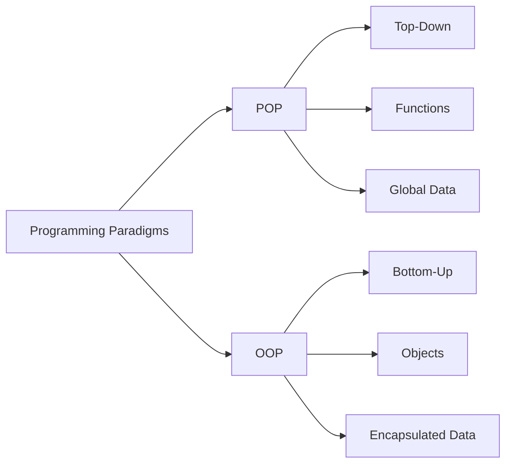
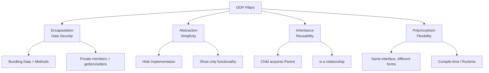
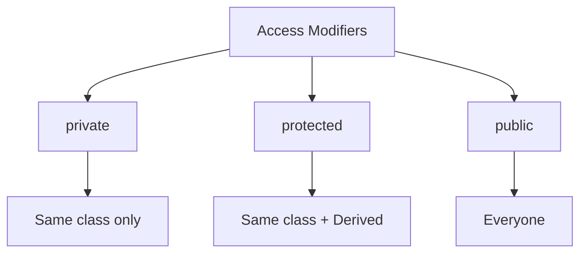
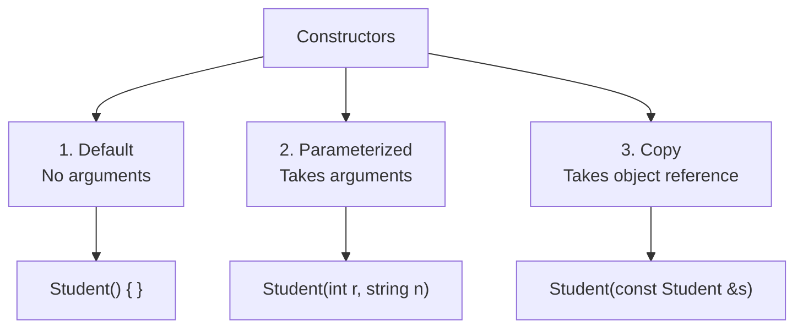
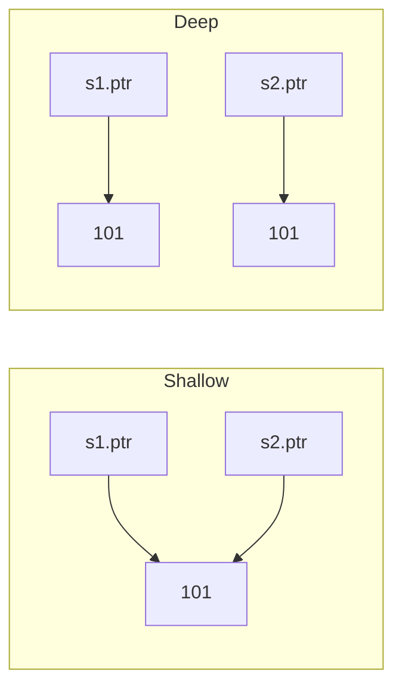
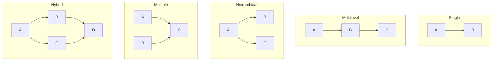
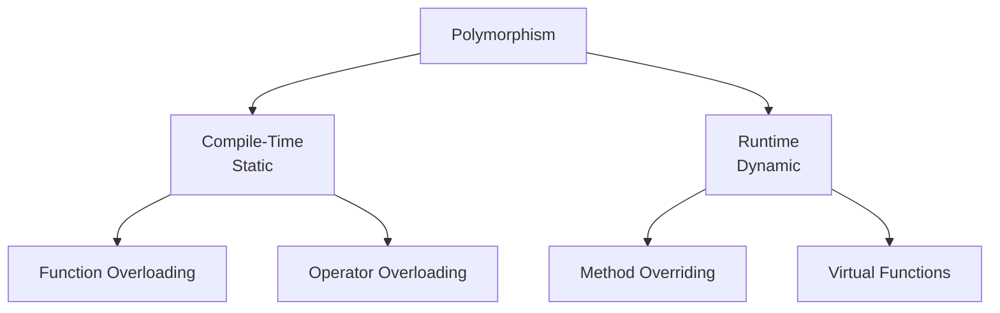
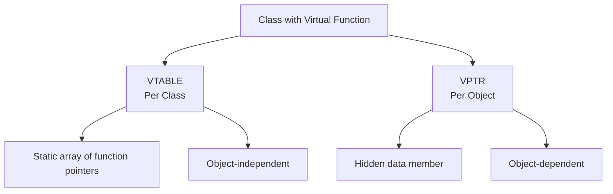
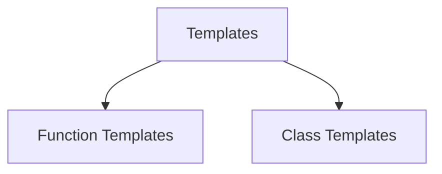

# 📘 OOP Complete Revision Guide — SDE-1 Interview Ready

> **One file. All topics. 100% coverage.**
> Covers C++ and Java. Structured for last-minute revision + deep understanding.

---

## 📑 Table of Contents

| Part | Topic | Key Focus |
|------|-------|-----------|
| 1 | Foundations | POP vs OOP, 4 Pillars, Why OOP |
| 2 | Classes & Objects | Class vs Object, Class vs Struct, Memory |
| 3 | Encapsulation & Access Modifiers | Data hiding, Access levels |
| 4 | Abstraction | Abstract classes, Interfaces |
| 5 | Constructors & Destructors | Types, Copy, Shallow/Deep, Rule of 3 |
| 6 | this Pointer, Static, Friend | Core mechanics |
| 7 | Inheritance | Types, Modes, Diamond Problem |
| 8 | Polymorphism | Overloading, Overriding, Virtual Functions |
| 9 | VTABLE & VPTR | Runtime polymorphism internals |
| 10 | Templates | Generic programming |
| 11 | Exception Handling | try/catch/throw |
| 12 | Keywords | const, explicit, final, super |
| 13 | SOLID & Design Patterns | Design principles |
| 14 | Output-Based Questions | Common trick questions |
| 15 | Quick Reference Tables | All comparisons at a glance |
| 16 | Study Plan & Checklist | Final revision |

---

## Part 1 — Foundations

### 🎯 What is OOP?

**OOP (Object-Oriented Programming)** is a programming paradigm that organizes software design around **objects** rather than functions and logic. An object bundles **data (attributes)** + **behavior (methods)** into a single unit.

> **Interview Definition:** *"OOP is a methodology to design a program using classes and objects, where everything is represented as an object."*

**First truly OOP language:** Smalltalk

---

### 🔄 POP vs OOP



| Feature | POP | OOP |
|---------|-----|-----|
| **Unit** | Functions | Objects |
| **Approach** | Top-Down | Bottom-Up |
| **Focus** | Functions/Logic | Data |
| **Access Specifiers** | ❌ None | ✅ public/private/protected |
| **Data Movement** | Free between functions | Encapsulated, controlled |
| **Security** | ❌ Less secure | ✅ Data hiding |
| **Overloading** | ❌ Not possible | ✅ Function + Operator |
| **Examples** | C, Pascal, FORTRAN | C++, Java, C#, Python |

---

### 🏛️ The 4 Pillars of OOP



| Pillar | Mnemonic | Definition | Example |
|--------|----------|------------|---------|
| 🔒 **Encapsulation** | Data Security | Bind data + methods into one unit, restrict access | Class with private fields |
| 🎭 **Abstraction** | Simplicity | Hide implementation, show functionality | `Shape.area()` — user doesn't know formula |
| 🧬 **Inheritance** | Reusability | Child acquires parent's properties | `Dog extends Animal` |
| 🎪 **Polymorphism** | Flexibility | Same interface, different behavior | `sound()` — Dog barks, Cat meows |

---

### ✅ Why OOP?

- 🧩 **Modularity** — Self-contained objects
- ♻️ **Reusability** — Via inheritance
- 🔐 **Security** — Data hiding
- 🛠️ **Maintainability** — Localized changes
- 🌍 **Real-world modeling** — Maps to real entities
- 📈 **Scalability** — Extensible via abstraction/polymorphism

### ❌ Disadvantages of OOP

- Requires **pre-work and planning**
- Can consume **large memory** in some scenarios
- **Not suitable for small problems**
- Needs **proper documentation** for later use

---

## Part 2 — Classes & Objects

### 📦 What is a Class?

> **Class** = User-defined blueprint/template from which objects are created. It has **properties (data members)** and **behaviors (member functions)**. **Logical entity**, no memory allocated when declared.

### 🧱 What is an Object?

> **Object** = Instance of a class. Real-world entity. **Physical entity** — memory allocated when created.

```cpp
class Student {          // ← Class (blueprint)
    string name;
    int rollNo;
public:
    void display() { cout << name << " - " << rollNo; }
};

int main() {
    Student s1;          // ← Object (instance)
    s1.name = "Alice";
    s1.rollNo = 101;
    s1.display();
}
```

### 🔍 Class vs Object

| Feature | Class | Object |
|---------|-------|--------|
| **Definition** | Blueprint/Template | Instance of class |
| **Existence** | Logical entity | Physical entity |
| **Memory** | ❌ Not allocated when declared | ✅ Allocated when created |
| **Quantity** | Declared once | Many can be created |
| **Values** | No specific values | Holds specific values |
| **Example** | `class Car { };` | `Car c1, c2;` |

---

### 🔧 Class vs Structure (C++)

> **Both are almost identical** — the only difference is **default access + default inheritance**.

| Feature | `class` | `struct` |
|---------|---------|----------|
| **Default member access** | 🔒 private | 🌐 public |
| **Default inheritance** | private | public |
| Methods? | ✅ | ✅ |
| Constructors/Destructors? | ✅ | ✅ |
| Inheritance? | ✅ | ✅ |
| Virtual functions? | ✅ | ✅ |
| **Typical use** | Encapsulated objects | Simple data holders (POD) |

```cpp
struct Point { int x, y; };              // public by default
class PointClass { int x, y; };          // private by default
```

**⚠️ Interview Trap:** Never say *"struct doesn't support inheritance"* in C++ — it's WRONG.

---

### 🧠 Memory Allocation for Objects

```
┌──────────────────────────────┐
│  CLASS (declaration only)     │  → NO memory allocated
└──────────────────────────────┘
              │
              │ object creation
              ▼
┌──────────────────────────────┐
│  OBJECT (instance)            │  → Memory allocated
│  + Own copy of data members   │
│  + Shared member functions    │
└──────────────────────────────┘
```

**Object memory allocation examples:**
```cpp
class Animal{};                       // sizeof = 1 byte (empty class)
class Animal{ int a; char ch; };      // sizeof = 8 bytes (with padding)
```

**Creating Objects:**
| Method | Syntax | Location |
|--------|--------|----------|
| Statically | `ClassName obj;` | Stack |
| Dynamically | `ClassName* obj = new ClassName();` | Heap |

---

## Part 3 — Encapsulation & Access Modifiers

### 🔒 Encapsulation

> **Encapsulation = Binding data + methods into a single unit (class) + restricting direct access.**

**Encapsulation = Data Hiding + Abstraction** *(some definitions)*

```cpp
class Student {
private:
    string name;
    int age;
public:
    void setAge(int a) {
        if (a > 0 && a < 100) age = a;   // validation
        else cout << "Invalid age!";
    }
    int getAge() { return age; }
};
```

**Benefits:**
- ✅ Data hiding — no direct access
- ✅ Validation in setters
- ✅ Read-only / write-only via getter/setter only
- ✅ Easy to unit test
- ✅ Control over data

---

### 🌐 Access Modifiers



### C++ Access Rules

| Modifier | Same Class | Derived Class | Outside |
|----------|:----------:|:-------------:|:-------:|
| 🔒 private | ✅ | ❌ | ❌ |
| 🛡️ protected | ✅ | ✅ | ❌ |
| 🌐 public | ✅ | ✅ | ✅ |

**Defaults:**
- `class` → **private**
- `struct` → **public**

### Java Access Rules

| Modifier | Same Class | Same Package (Sub) | Same Package (Non-Sub) | Diff Package (Sub) | Diff Package (Non-Sub) |
|----------|:----------:|:------------------:|:----------------------:|:------------------:|:----------------------:|
| `default` | ✅ | ✅ | ✅ | ❌ | ❌ |
| `private` | ✅ | ❌ | ❌ | ❌ | ❌ |
| `protected` | ✅ | ✅ | ✅ | ✅ | ❌ |
| `public` | ✅ | ✅ | ✅ | ✅ | ✅ |

---

### 🎭 Abstraction vs Encapsulation

| Abstraction | Encapsulation |
|-------------|---------------|
| 🎯 Hides **unnecessary details** | 📦 **Binds** data + methods |
| Focus: **WHAT** object does | Focus: **HOW** data protected |
| Design/interface level | Implementation level |
| Achieved via **abstract classes, interfaces** | Achieved via **access modifiers** |
| Example: `Shape.area()` | Example: private `name` + `getName()` |

> 💡 **They are complementary — not competing.**

---

## Part 4 — Abstraction

### 🎭 Abstraction in C++

**1. Using Classes** — access specifiers decide visibility.
**2. Header Files** — e.g., `pow()` in `math.h` — call without knowing implementation.

### 📜 Abstract Class

> **Abstract Class** = Class with at least **one pure virtual function**. Cannot be instantiated.

```cpp
class Shape {
public:
    virtual double area() = 0;   // pure virtual
    virtual ~Shape() {}
};

class Circle : public Shape {
public:
    double area() override { return 3.14 * 5 * 5; }
};
```

**Rules:**
- ❌ Cannot instantiate
- ✅ Can have pointers/references
- ✅ Derived must implement ALL pure virtuals, or itself becomes abstract

### 🧩 Interface (Java)

> **Interface** = 100% abstraction. Only abstract methods + static constants.

```java
interface Drawable {
    void draw();   // public abstract by default
}
```

**Features:**
- 💯 Total abstraction
- ✅ Multiple inheritance (via interfaces)
- ✅ Loose coupling

### ⚖️ Abstract Class vs Interface

| Feature | Abstract Class | Interface |
|---------|----------------|-----------|
| Methods | Abstract + concrete | Only abstract (Java 8+: default/static) |
| Data members | Any type | static + final only |
| Multiple inheritance | ❌ | ✅ |
| Constructor | ✅ | ❌ |
| Keyword | `abstract` | `interface` |
| Abstraction % | 0–100% | 100% |
| Access | private/protected OK | public by default |

---

## Part 5 — Constructors & Destructors

### 🏗️ Constructor

> **Special member function** automatically called when object is created. Initializes data members.

**Characteristics:**
1. Same name as class
2. ❌ No return type (not even `void`)
3. ✅ Called automatically at object creation
4. ✅ Can be **overloaded**
5. ❌ Cannot be **virtual** (no VTABLE exists yet)
6. ❌ Cannot be **inherited**
7. ❌ Cannot be **static**
8. ❌ Address cannot be referenced
9. Usually in **public** section
10. Implicit calls to `new`/`delete`

### 🎯 Types of Constructors



#### 1. Default Constructor
```cpp
Student() { rollNo = 0; }
```
- If not defined → compiler generates **empty one** (garbage values)
- If parameterized defined → compiler will **NOT** generate default

#### 2. Parameterized Constructor
```cpp
Student(int r, string n) { rollNo = r; name = n; }
Student s1(101, "Alice");              // implicit
Student s2 = Student(102, "Bob");      // explicit
```

#### 3. Copy Constructor
```cpp
Student(const Student &s) { rollNo = s.rollNo; }
Student s2 = s1;                       // copy constructor called
```

---

### 📋 Copy Constructor Deep Dive

**Called when:**
1. New object initialized from another: `Student s2 = s1;`
2. Object passed **by value** to function
3. Object returned **by value** from function

**Why must argument be by reference?**
- If by value → calling copy constructor requires making a copy → invokes copy constructor → **infinite recursion**

**Why `const`?**
- Prevent accidental modification, allow copying `const` objects

**Can it be private?**
- ✅ Yes — makes class **non-copyable**. Useful for classes with pointers/dynamic resources.

---

### 📋 Copy Constructor vs Assignment Operator

```cpp
MyClass t1, t2;
MyClass t3 = t1;   // (1) Copy Constructor
t2 = t1;           // (2) Assignment Operator
```

| Copy Constructor | Assignment Operator |
|------------------|---------------------|
| Creates **new object** | Assigns to **existing object** |
| Makes new memory storage | Does **NOT** make new memory |
| `MyClass t3 = t1;` | `t2 = t1;` |

---

### 🔍 Shallow vs Deep Copy



| Feature | Shallow Copy | Deep Copy |
|---------|--------------|-----------|
| **Pointer** | Copies address | Allocates new memory |
| **Independence** | Shared memory | Independent |
| **Default?** | ✅ Compiler-generated | ❌ Must be user-defined |
| **Risk** | Dangling pointer, double-free | Safe, slower |
| **When needed** | Simple classes | Dynamic memory classes |

**Deep Copy Code:**
```cpp
Student(const Student& s) {
    rollNo = new int(*(s.rollNo));   // allocate new memory
}
```

---

### 🏛️ Rule of Three

> If a class needs a custom **destructor**, **copy constructor**, or **copy assignment operator**, it likely needs **all three**.

```cpp
class Student {
    int* rollNo;
public:
    Student(int r) { rollNo = new int(r); }
    ~Student() { delete rollNo; }                    // destructor
    Student(const Student& s) {                      // copy constructor
        rollNo = new int(*(s.rollNo));
    }
    Student& operator=(const Student& s) {           // copy assignment
        if (this != &s) { delete rollNo; rollNo = new int(*(s.rollNo)); }
        return *this;
    }
};
```

---

### 💥 Destructor

> **Opposite of constructor**. Destroys object, frees acquired resources.

**Syntax:** `~ClassName() { }`

**Called when:**
1. Object goes out of scope
2. Program ends
3. `{}` scope containing local var ends
4. `delete` called on dynamic object

**Rules:**
- ✅ Starts with `~`, same name as class
- ❌ Only **one** per class (no overloading)
- ❌ No parameters
- ❌ No return type
- ❌ Cannot be `static` or `const`
- ✅ Compiler generates default if not specified
- ⚠️ Custom destructor needed for **dynamic memory** to avoid leaks

---

### 🔥 Virtual Destructor

**Problem without virtual destructor:**
```cpp
Base* bp = new Derived();
delete bp;   // Only Base destructor called! Derived destructor skipped → MEMORY LEAK
```

**Solution:**
```cpp
class Base {
public:
    virtual ~Base() { }   // virtual destructor
};
// Now: Derived destructor → Base destructor
```

**Rule:** If class has ANY virtual function → give it a **virtual destructor**.

### 🎯 Pure Virtual Destructor
```cpp
class Base {
public:
    virtual ~Base() = 0;   // pure virtual
};
Base::~Base() { }          // ⚠️ MUST still define body!
```
**Why body needed?** Destructors aren't "overridden" — they're called in reverse order. If no body, nothing to call during destruction.

---

### 🔒 Private Destructor

**Uses:**
- Control destruction of objects
- Prevent dangling references

**Examples:**

**1. Only pointer — no object:**
```cpp
class Test { private: ~Test() {} };
int main() { Test* t; }   // ✅ Works
```

**2. Dynamic allocation:**
```cpp
int main() { Test* t = new Test; }   // ✅ Works (delete is programmer's job)
```

**3. Friend function deletes:**
```cpp
class Test {
    ~Test() {}
public:
    friend void destructTest(Test*);
};
void destructTest(Test* ptr) { delete ptr; }
```

**4. Class instance method:**
```cpp
class parent {
    ~parent() { }
public:
    parent() { }
    void destruct() { delete this; }
};
```

---

## Part 6 — this Pointer, Static, Friend

### 👉 this Pointer

> Implicit pointer available only inside **non-static member functions**. Points to the current object.

**Uses:**
1. **Resolve name conflicts** → `this->x = x;`
2. **Return current object** → `return *this;`
3. **Pass current object** as parameter

```cpp
class Mobile {
    string model; int year;
public:
    void set(string model, int year) {
        this->model = model;   // required
        this->year = year;
    }
};
```

**Not available in:** static functions, friend functions

---

### 📊 Static Data Member

> Shared by **all objects** of the class. Only **one copy** exists.

**Key points:**
- Declared inside class with `static`
- **Defined outside** class: `int ClassName::count = 0;`
- Initialized **before any object creation**
- Lifetime = entire program
- Used for **common properties** (rate, company name) or **counters**

```cpp
class Student {
    static int count;
public:
    Student() { count++; }
    static int getCount() { return count; }
};
int Student::count = 0;   // ← outside definition
```

---

### ⚙️ Static Member Function

> Works for class as a whole, not for a specific object.

**Key points:**
- ✅ Called using class name: `ClassName::func()`
- ✅ No object needed
- ✅ Can access **only static** members
- ❌ No `this` pointer
- ❌ Cannot be virtual

```cpp
class Math {
    static int count;
public:
    static int add(int a, int b) { return a + b; }
};
int main() { cout << Math::add(2, 3); }   // 5
```

---

### 🤝 Friend Function

> Non-member function granted access to **private and protected** members.

**Characteristics:**
- ❌ Not in scope of class
- ❌ Cannot be called using object
- ✅ Invoked like normal function
- ❌ Cannot access members directly (need object)
- ✅ Can be in public or private section (no difference)
- ⚠️ **Violates encapsulation** → C++ is not "pure" OOP

```cpp
class Box {
    int length;
public:
    Box() { length = 10; }
    friend int printLength(Box b);   // declaration
};

int printLength(Box b) {             // no `friend`, no `::`
    b.length += 10;
    return b.length;
}
```

### 🤝 Friend Class
When a class is declared as friend, **all its member functions** become friend functions.

```cpp
class Other { void fun(); };
class WithFriend {
    int i;
public:
    friend void Other::fun();   // one function
    friend class Other;         // entire class
};
```

---

## Part 7 — Inheritance

### 🧬 What is Inheritance?

> Mechanism where **child class** acquires properties + behaviors of **parent class**. Represents **"is-a"** relationship.

**Terms:**
- **Base/Parent/Super class** — the class being inherited
- **Derived/Child/Sub class** — the class that inherits
- **Reusability** — reuse methods/fields

**Syntax:**
```cpp
class Child : access_mode Parent { /* ... */ };
```

---

### 🌳 Types of Inheritance



| Type | Structure | Description |
|------|-----------|-------------|
| **Single** | A → B | One base, one derived |
| **Multilevel** | A → B → C | Chain of inheritance |
| **Hierarchical** | A → B, A → C | One base, multiple derived |
| **Multiple** | A, B → C | Multiple bases, one derived |
| **Hybrid** | Combination | Any mix |

**Note:** Java **does NOT** support multiple inheritance via classes (only via interfaces).

---

### 🛡️ Modes of Inheritance (C++)

| Base Member → | Public Derivation | Protected Derivation | Private Derivation |
|---------------|:-----------------:|:--------------------:|:------------------:|
| `public` | public | protected | private |
| `protected` | protected | protected | private |
| `private` | ❌ Not inherited | ❌ Not inherited | ❌ Not inherited |

**Defaults:**
- `class` → **private** inheritance
- `struct` → **public** inheritance

---

### 💎 Diamond Problem

**Structure:**
```
      A
     / \
    B   C
     \ /
      D
```

**Problem:** D gets **two copies** of A's members → **ambiguity**.

```cpp
class A { public: int data; };
class B : public A { };
class C : public A { };
class D : public B, public C { };

int main() {
    D obj;
    obj.data = 10;   // ERROR: ambiguous!
}
```

**Solution: Virtual Base Class**

```cpp
class B : virtual public A { };
class C : virtual public A { };
class D : public B, public C { };   // ✅ Only ONE shared A
```

**How it works:** B and C store **virtual base pointer** to shared A. Only one A subobject exists in D.

---

### 🏗️ Constructor Handling in Inheritance

> Derived class constructor **must call** base class constructors if they take arguments.

```cpp
class A { 
protected: int a;
public: A(int x) { a = x; }
};

class B {
protected: int b;
public: B(int y) { b = y; }
};

class C : public A, public B {
    int c;
public:
    C(int p, int q, int r) : A(p), B(q) { c = r; }   // ← initialization list
};
```

**Constructor call order:** Base classes first (in order of declaration), then derived.

---

### ⚠️ Ambiguity Resolution

When two base classes have a function with **same name**:

```cpp
class A { public: void show() { cout << "A"; } };
class B { public: void show() { cout << "B"; } };
class C : public A, public B { };

int main() {
    C obj;
    // obj.show();       // ERROR: ambiguous
    obj.A::show();       // ✅ A
    obj.B::show();       // ✅ B
}
```

---

### 🧱 Object Slicing

> When derived object assigned to base object **by value** → derived-specific members are "sliced off".

```cpp
class Base { public: int a; };
class Derived : public Base { public: int b; };

int main() {
    Derived d;
    Base b = d;   // ❌ Slicing! 'b' only has 'a'
}
```

**Solution:** Use pointers or references:
```cpp
Base* bp = &d;   // ✅ No slicing
Base& br = d;    // ✅ No slicing
```

---

### ⚖️ Inheritance vs Composition

| Feature | Inheritance | Composition |
|---------|-------------|-------------|
| **Relationship** | is-a | has-a |
| **Coupling** | Tight | Loose |
| **Flexibility** | Fixed at compile time | Can change at runtime |
| **Encapsulation** | Breaks | Preserves |
| **Fragile Base** | ⚠️ Yes | ✅ No |

> 💡 **Rule:** *Favor composition over inheritance.*

---

### ❌ Limitations of Inheritance

1. **Tight coupling** — parent changes break child
2. **Fragile Base Class Problem** — safe-looking changes break derived
3. **Deep hierarchies = complexity** — hard to debug
4. **Inflexibility** — fixed at compile time
5. **Breaks encapsulation** — exposes protected members
6. **Diamond Problem** — multiple inheritance ambiguity
7. **Overuse = poor design** — wrong abstractions

---

## Part 8 — Polymorphism

### 🎪 What is Polymorphism?

> **"Many forms"** — ability of a single interface to represent different behaviors.

### 🌟 Types



| Type | Binding | Achieved by | Inheritance? |
|------|---------|-------------|:------------:|
| **Compile-Time** | Early binding | Function/Operator overloading | ❌ |
| **Runtime** | Late binding | Method overriding + virtual | ✅ |

---

### 📚 Function Overloading

> Multiple functions with **same name** but **different parameters** (number, type, order).

```cpp
int add(int a, int b) { return a + b; }
double add(double a, double b) { return a + b; }
int add(int a, int b, int c) { return a + b + c; }
```

**Rules:**
- Same function name ✅
- Different parameter list ✅
- Return type alone can't distinguish ❌

### ⚠️ Causes of Ambiguity

**1. Type Conversion:**
```cpp
void fun(int i) { }
void fun(float j) { }
fun(1.2);   // ERROR: 1.2 is double → ambiguous
```

**2. Default Arguments:**
```cpp
void fun(int i) { }
void fun(int a, int b = 9) { }
fun(12);    // ERROR: ambiguous
```

**3. Pass by Reference vs Value:**
```cpp
void fun(int) { }
void fun(int &) { }
int a = 10; fun(a);   // ERROR: ambiguous
```

---

### 🔧 Operator Overloading

> Redefine behavior of existing operators for **user-defined types**.

**Rules:**
1. Only **existing** operators can be overloaded
2. At least one operand must be **user-defined**
3. Cannot change precedence/associativity
4. `=`, `&` already overloaded by default
5. Some must be **member functions**: `=`, `[]`, `()`, `->`
6. Some better as **non-member**: `<<`, `>>`

**Cannot be overloaded:**
- `::` (scope resolution)
- `sizeof`
- `.` (member selector)
- `.*` (member pointer selector)
- `?:` (ternary)

```cpp
class Complex {
    int real, imag;
public:
    Complex(int r = 0, int i = 0) : real(r), imag(i) {}
    Complex operator+(const Complex& b) {
        return Complex(real + b.real, imag + b.imag);
    }
};
```

**Member vs Friend:**
| Operator | Member Function | Friend Function |
|----------|:---------------:|:---------------:|
| Unary | 0 args | 1 arg |
| Binary | 1 arg | 2 args |

---

### 🎭 Method Overriding

> Derived class **redefines** virtual base method with **same signature**. Runtime polymorphism.

**Rules:**
1. Same name + parameters ✅
2. Base method must be **virtual**
3. Only via inheritance
4. Cannot override non-virtual/static/constructor
5. Can change access modifier (usually kept same)

```cpp
class Animal {
public:
    virtual void sound() { cout << "Animal\n"; }
};
class Dog : public Animal {
public:
    void sound() override { cout << "Bark\n"; }   // override keyword (C++11)
};
```

---

### 🎯 Virtual Functions

> Member function declared with `virtual` in base, overridden in derived. Runtime dispatch via VTABLE.

**Rules:**
1. Must be members of a class
2. ❌ Cannot be static
3. ✅ Accessed via pointer/reference of base class
4. Prototype must match
5. Not mandatory to override
6. ✅ Can have virtual destructor, ❌ virtual constructor
7. If base has virtual → derived version automatically virtual

```cpp
class Base {
public:
    virtual void show() { cout << "Base\n"; }
};
class Derived : public Base {
public:
    void show() override { cout << "Derived\n"; }
};

int main() {
    Base* bp = new Derived();
    bp->show();   // Output: Derived ✅
}
```

---

### 🔒 Virtual Function Can Be Private

```cpp
class base {
public:
    virtual void print() { cout << "base\n"; }
};
class derived : public base {
private:
    void print() override { cout << "derived\n"; }   // private!
};

int main() {
    base* b = new derived();
    b->print();   // ✅ Still works! Access from base interface
}
```

**Why?** Access checked against **static declaring type** (base), not polymorphic call site.

---

### 🚀 Early vs Late Binding

| Early Binding (Static) | Late Binding (Dynamic) |
|------------------------|------------------------|
| Compile time | Runtime |
| Type of pointer | Content pointed to (object) |
| Non-virtual functions | Virtual functions |
| Faster | Slower (vtable lookup) |

```cpp
class base {
public:
    virtual void print() { cout << "base print\n"; }
    void show() { cout << "base show\n"; }
};
class derived : public base {
public:
    void print() override { cout << "derived print\n"; }
    void show() { cout << "derived show\n"; }
};

base* bptr; derived d; bptr = &d;
bptr->print();   // Late binding → "derived print"
bptr->show();    // Early binding → "base show"
```

---

### ⚠️ Virtual Function in Constructor/Destructor

**⚠️ Virtual dispatch does NOT work** during construction/destruction.

```cpp
class Base {
public:
    Base() { show(); }              // calls Base::show()
    virtual void show() { cout << "Base\n"; }
};
class Derived : public Base {
public:
    Derived() { show(); }           // calls Derived::show()
    void show() override { cout << "Derived\n"; }
};
// Output: Base, then Derived
```

**Why?** VPTR points to current class's VTABLE — derived part doesn't exist yet.

---

### 🚫 Limitations of Virtual Functions

1. **Slower** — runtime overhead
2. **Harder to debug** — indirect calls
3. **Increased object size** — VPTR per object

---

## Part 9 — VTABLE & VPTR

### 🔍 What Happens When Class Has Virtual Function?

Compiler adds **TWO mechanisms:**



**1. VTABLE (Virtual Table)**
- Static array of function pointers
- One per class
- Points to most-derived version of each virtual function
- **Created at compile time**

**2. VPTR (Virtual Pointer)**
- Hidden data member in each object
- Points to class's VTABLE
- **Initialized in constructor**

### 🎬 How It Works

```
Base* bp = new Derived();

Object: Derived
┌──────────────┐
│ VPTR ────────┼───→ Derived VTABLE
│ data         │     ┌─────────────────────┐
└──────────────┘     │ &Derived::show()    │
                     │ &Base::show()       │
                     └─────────────────────┘

bp->show();

1. bp points to Derived object
2. Fetch VPTR from object
3. VPTR points to Derived VTABLE
4. Look up show() → Derived::show()
5. Call it at runtime
```

### 📝 How Compiler Fills VTABLE

For each virtual function:
1. Check if overridden in **current** class → point to it
2. Else check **parent** → point to parent's
3. Else check **grandparent** → etc.

**Example (A → B → C):**
- Fill for C: if in C → C, else B → B, else A → A

### 🎯 VTABLE Filling Example

```cpp
class base {
public:
    void fun_1() { cout << "base-1\n"; }
    virtual void fun_2() { cout << "base-2\n"; }
    virtual void fun_3() { cout << "base-3\n"; }
    virtual void fun_4() { cout << "base-4\n"; }
};
class derived : public base {
public:
    void fun_1() { cout << "derived-1\n"; }
    void fun_2() { cout << "derived-2\n"; }
    void fun_4(int x) { cout << "derived-4\n"; }   // DIFFERENT signature!
};

int main() {
    base *p; derived obj1; p = &obj1;
    p->fun_1();  // base-1 (non-virtual, early binding)
    p->fun_2();  // derived-2 (late binding)
    p->fun_3();  // base-3 (not overridden)
    p->fun_4();  // base-4 (derived's fun_4(int) is DIFFERENT)
}
```

---

## Part 10 — Templates & Generic Programming

### 🎯 What are Templates?

> Generic programming — write code independent of data type. Follows **DRY** principle.

### 🌟 Types



### 1️⃣ Function Templates

```cpp
template <class T>
T max(T a, T b) { return (a > b) ? a : b; }

int main() {
    cout << max(3, 7);       // T = int
    cout << max(3.5, 2.1);   // T = double
}
```

### 2️⃣ Class Templates

```cpp
template <class T>
class Vector {
    T* arr; int size;
public:
    Vector(int m) { size = m; arr = new T[size]; }
    T dotProd(Vector& v) {
        T d = 0;
        for (int i = 0; i < size; i++) d += arr[i] * v.arr[i];
        return d;
    }
};
```

### 🔢 Multiple Parameters

```cpp
template <class T1, class T2>
class Test {
    T1 a; T2 b;
public:
    Test(T1 x, T2 y) : a(x), b(y) {}
    void show() { cout << a << " " << b; }
};

Test<float, int> t1(1.23, 123);
Test<int, char> t2(100, 'w');
```

### 🎁 Default Parameters

```cpp
template <class T1 = int, class T2 = float, class T3 = char>
class MyClass {
public:
    T1 a; T2 b; T3 c;
    MyClass(T1 x, T2 y, T3 z) : a(x), b(y), c(z) {}
};
```

### ⚖️ Template vs Overloading

| Template | Overloading |
|----------|-------------|
| One generic definition | Multiple definitions |
| Compiler instantiates per type | Compiler picks based on args |
| Follows DRY | Repetitive |
| `template<class T> T max(T, T)` | `int max(int,int)`, `double max(double,double)` |

**Priority:** Exact match (non-template) > Template instantiation

---

## Part 11 — Exception Handling

### 🎯 What is Exception Handling?

> Handling **runtime anomalies** (division by zero, out-of-bounds, memory exhaustion) so program doesn't crash abruptly.

### 🔀 Types of Errors

| Error | Exception |
|-------|-----------|
| Serious, irrecoverable | Abnormal but recoverable |
| System/environment caused | Program caused |
| OutOfMemory, StackOverflow | ArithmeticException, NullPointer |
| Not meant to be caught | Meant to be caught |

### 🛠️ Mechanism: try / catch / throw

```cpp
try {
    // code that may throw
    if (b == 0) throw b;
    c = a / b;
}
catch (int e) {
    cout << "Division by " << e << endl;
}
```

**Flow:**
1. **Hit** the exception
2. **Throw** the exception
3. **Catch** the exception
4. **Handle** (corrective action)

### 📚 Multiple Catch Blocks

```cpp
try { /* ... */ }
catch (int e) { }
catch (char c) { }
catch (double d) { }
catch (...) { }   // catch-all
```

**Rules:**
- try must be **immediately followed** by catch
- **First matching** catch block is executed

### 🔄 Rethrowing

```cpp
void MyHandler() {
    try { throw "hello"; }
    catch (const char*) {
        cout << "Caught inside\n";
        throw;   // rethrow to outer handler
    }
}
```

### 📋 Specifying Exceptions

```cpp
void func() throw(int, char) {
    // can only throw int or char
}
```

---

## Part 12 — Important Keywords

### 🔑 const

> Prevents modification of variables, pointers, member functions.

**Rules:**
```cpp
const int var;         // ❌ Invalid — no value
const int var; var=5;  // ❌ Invalid — assigned separately
const int var = 5;     // ✅ Valid — declared + initialized
```

**Const with Pointers:**
| Declaration | Value | Pointer |
|-------------|:-----:|:-------:|
| `const int* ptr` | ❌ | ✅ |
| `int* const ptr` | ✅ | ❌ |
| `const int* const ptr` | ❌ | ❌ |

**Const Member Function:** `void fun() const { }` — cannot modify object's data members.

---

### 🔑 explicit

> Prevents implicit type conversions via single-argument constructors.

```cpp
class Complex {
    double real;
public:
    explicit Complex(double r) : real(r) {}
};

void func(Complex c) {}
func(3.0);              // ❌ ERROR with explicit
func(Complex(3.0));     // ✅ OK: explicit cast
```

---

### 🔑 final

> Prevents inheritance or overriding.

```cpp
class Base final { };                    // cannot be inherited
class A {
    virtual void show() final { }        // cannot be overridden
};
```

- **Final variable:** Value can't change
- **Final method:** Can't be overridden (but inherited)
- **Final class:** Can't be extended
- **Can constructor be final?** ❌ No (never inherited)

---

### 🔑 super (Java)

> Reference to **immediate parent class** object.

**Three uses:**
1. Refer to parent's instance variable
2. Invoke parent's method
3. `super()` — invoke parent's constructor

> 💡 `super()` is auto-added by compiler if no explicit `super()` or `this()`.

---

### 🔑 namespace

> Prevents name conflicts in large projects.

```cpp
namespace first { int x = 1; }
namespace second { int x = 2; }

int main() {
    int x = 3;
    cout << x;              // 3
    cout << second::x;      // 2
    cout << first::x;       // 1
}
```

**`using namespace std;`** — brings all `std` names into current scope.

---

### 🔑 inline

> Function whose code is **expanded inline** at call site. Faster execution (no function call overhead).

```cpp
inline int add(int a, int b, int c) {
    return a + b + c;
}
```

**When inline doesn't work:**
- Function has **loops/switch**
- Function has **static variables**
- Function is **recursive**
- Function returns value but contains `return` statement not returning

---

## Part 13 — SOLID Principles & Design Patterns

### 🏛️ SOLID Principles

| Principle | Meaning | One-liner |
|-----------|---------|-----------|
| **S** — Single Responsibility | Class should have only **one reason to change** | One job per class |
| **O** — Open/Closed | Open for **extension**, closed for **modification** | Add code, don't modify old |
| **L** — Liskov Substitution | Subtypes must be usable in place of **base types** | Derived behaves like base |
| **I** — Interface Segregation | Many small interfaces > one large | Don't force unnecessary methods |
| **D** — Dependency Inversion | Depend on **abstractions**, not concrete | High-level ≠ low-level details |

---

### 🎨 Design Patterns

> Reusable solution to a common software design problem.

| Pattern | Purpose |
|---------|---------|
| **Singleton** | One instance, global access |
| **Factory** | Create objects without specifying class |
| **Observer** | Notify dependents of state changes |
| **Strategy** | Family of algorithms, interchangeable |
| **Adapter** | Incompatible interfaces work together |

**Singleton:**
```cpp
class Singleton {
    static Singleton* instance;
    Singleton() {}
public:
    static Singleton* getInstance() {
        if (!instance) instance = new Singleton();
        return instance;
    }
};
```

---

### 🔗 Association vs Aggregation vs Composition

| Relationship | Type | Ownership | Lifetime |
|--------------|------|-----------|----------|
| **Association** | "uses-a" | None | Independent |
| **Aggregation** | "has-a" (weak) | Weak | Part can exist independently |
| **Composition** | "has-a" (strong) | Strong | Part cannot exist without whole |

**Examples:**
- Association: Teacher — Student
- Aggregation: Team — Player
- Composition: House — Room

**Diagram:**
```
Association:  A ────→ B
Aggregation:  A ◇───→ B   (hollow diamond)
Composition:  A ◆───→ B   (filled diamond)
```

---

## Part 14 — Output-Based Questions

### 📝 Q1: Virtual Function Output

```cpp
class Base { public: virtual void show() { cout << "In Base\n"; } };
class Derived : public Base { public: void show() { cout << "In Derived\n"; } };
int main() {
    Base *bp = new Derived;
    bp->show();
    bp->Base::show();
}
```
**Output:**
```
In Derived
In Base
```

### 📝 Q2: Virtual Destructor

```cpp
class Base {
public:
    Base() { cout << "Base Constructor\n"; }
    virtual ~Base() { cout << "Base Destructor\n"; }
};
class Derived : public Base {
public:
    Derived() { cout << "Derived Constructor\n"; }
    ~Derived() { cout << "Derived Destructor\n"; }
};
int main() { Base *bp = new Derived(); delete bp; }
```
**Output:**
```
Base Constructor
Derived Constructor
Derived Destructor
Base Destructor
```

### 📝 Q3: sizeof with Virtual Function

```cpp
class A { public: virtual void fun(); };
class B { public: void fun(); };
```
**Answer:** `sizeof(A) > sizeof(B)` — A has **VPTR** (typically 8 bytes).

### 📝 Q4: Can static functions be virtual?

```cpp
class Test { public: virtual static void fun() {} };
```
**Answer:** ❌ **Compiler error** — static functions are class-specific, virtual are object-specific.

### 📝 Q5: Virtual in multilevel inheritance

```cpp
class A { public: virtual void fun() { cout << "A::fun "; } };
class B : public A { public: void fun() { cout << "B::fun "; } };
class C : public B { public: void fun() { cout << "C::fun "; } };
int main() { B *bp = new C; bp->fun(); }
```
**Answer:** `C::fun()` — `B::fun()` is virtual automatically (inherited from A). All descendants virtual.

### 📝 Q6: Pure virtual + derived

```cpp
class Base { public: virtual void show() = 0; };
class Derived : public Base {};
int main() { Derived q; }
```
**Answer:** ❌ **Compiler error** — Derived doesn't override pure virtual → Derived is abstract.

### 📝 Q7: Abstract class pointer

```cpp
class Base { public: virtual void show() = 0; };
int main() {
    Base b;      // Line 1
    Base *bp;    // Line 2
}
```
**Answer:**
- Line 1: ❌ Error — can't instantiate abstract class
- Line 2: ✅ OK — pointer allowed

### 📝 Q8: Virtual function in constructor

```cpp
class Base {
public:
    Base() { show(); }
    virtual void show() { cout << "Base\n"; }
};
class Derived : public Base {
public:
    Derived() { show(); }
    void show() override { cout << "Derived\n"; }
};
int main() { Derived d; }
```
**Output:**
```
Base
Derived
```
**Explanation:** In Base constructor, object is still Base → Base::show(). In Derived constructor, object is Derived → Derived::show().

### 📝 Q9: Scope resolution bypasses virtual

```cpp
class Base { public: virtual void show() { cout << "In Base\n"; } };
class Derived : public Base { public: void show() { cout << "In Derived\n"; } };
int main() { Base *bp = new Derived; bp->Base::show(); }
```
**Output:** `In Base`

### 📝 Q10: Derived fun_4 with different signature

```cpp
class base {
public:
    virtual void fun_2() { cout << "base-2\n"; }
    virtual void fun_4() { cout << "base-4\n"; }
};
class derived : public base {
public:
    void fun_2() { cout << "derived-2\n"; }
    void fun_4(int x) { cout << "derived-4\n"; }   // different signature!
};
int main() { base *p; derived obj; p = &obj; p->fun_4(); }
```
**Output:** `base-4` (different signature → different function → no override)

---

## Part 15 — Quick Reference Tables

### 🔥 All Comparison Tables

#### POP vs OOP
| POP | OOP |
|-----|-----|
| Functions | Objects |
| Top-Down | Bottom-Up |
| Focus on functions | Focus on data |
| No access specifiers | public/private/protected |
| Less secure | Data hiding |
| C, Pascal | C++, Java |

#### Class vs Object
| Class | Object |
|-------|--------|
| Blueprint | Instance |
| Logical | Physical |
| No memory | Memory allocated |
| Declared once | Many created |
| `class Car { }` | `Car c1, c2;` |

#### Class vs Struct (C++)
| class | struct |
|-------|--------|
| private default | public default |
| private inheritance | public inheritance |

#### Abstraction vs Encapsulation
| Abstraction | Encapsulation |
|-------------|---------------|
| Hides details | Binds data + methods |
| WHAT | HOW |
| Design level | Implementation level |
| Abstract classes | Access modifiers |

#### Overloading vs Overriding
| Overloading | Overriding |
|-------------|------------|
| Compile-time | Runtime |
| Same class | Base + Derived |
| Different signature | Same signature |
| No virtual needed | Virtual required |
| No inheritance | Inheritance required |

#### Shallow vs Deep Copy
| Shallow | Deep |
|---------|------|
| Copies address | Allocates new memory |
| Shared memory | Independent |
| Compiler-generated | User-defined |
| Dangling risk | Safe |

#### Copy Constructor vs Assignment Operator
| Copy Constructor | Assignment Operator |
|------------------|---------------------|
| New object | Existing object |
| New memory | No new memory |
| `MyClass t3 = t1;` | `t2 = t1;` |

#### Early vs Late Binding
| Early | Late |
|-------|------|
| Compile-time | Runtime |
| Pointer type | Object type |
| Non-virtual | Virtual |
| Faster | Slower |

#### Inheritance vs Composition
| Inheritance | Composition |
|-------------|-------------|
| is-a | has-a |
| Tight coupling | Loose coupling |
| Fixed at compile time | Changeable at runtime |
| Fragile base | No fragile base |

#### Abstract Class vs Interface
| Abstract | Interface |
|----------|-----------|
| Abstract + concrete | Only abstract (Java 8+) |
| Any data members | static + final (Java) |
| No multiple inheritance | Multiple via interfaces |
| 0–100% abstraction | 100% abstraction |
| `extends` | `implements` |

---

### 🎯 Topic-to-Question Mapping

| Interview Question | Topic Reference |
|--------------------|-----------------|
| What is OOP? | Part 1 |
| 4 pillars? | Part 1 |
| Class vs Object? | Part 2 |
| Class vs Struct? | Part 2 |
| Encapsulation? | Part 3 |
| Abstraction vs Encapsulation? | Part 3 |
| Abstract class vs Interface? | Part 4 |
| Types of constructors? | Part 5 |
| Copy constructor? | Part 5 |
| Shallow vs Deep copy? | Part 5 |
| Rule of Three? | Part 5 |
| Virtual destructor? | Part 5 |
| this pointer? | Part 6 |
| Static members? | Part 6 |
| Friend function? | Part 6 |
| Why C++ not pure OOP? | Part 6 |
| Inheritance types? | Part 7 |
| Diamond problem? | Part 7 |
| Modes of inheritance? | Part 7 |
| Object slicing? | Part 7 |
| Polymorphism types? | Part 8 |
| Function overloading? | Part 8 |
| Operator overloading? | Part 8 |
| Method overriding? | Part 8 |
| Virtual functions? | Part 8 |
| VTABLE/VPTR? | Part 9 |
| Templates? | Part 10 |
| Exception handling? | Part 11 |
| const keyword? | Part 12 |
| explicit keyword? | Part 12 |
| final keyword? | Part 12 |
| SOLID principles? | Part 13 |
| Design patterns? | Part 13 |
| Output-based? | Part 14 |

---

### 🧠 Mnemonics

| Topic | Mnemonic |
|-------|----------|
| 4 Pillars | **E-A-I-P** (Encapsulation, Abstraction, Inheritance, Polymorphism) |
| Pillar Goals | 🔒 Data Security, 🎭 Simplicity, 🧬 Reusability, 🎪 Flexibility |
| SOLID | **S**ingle, **O**pen, **L**iskov, **I**nterface, **D**ependency |
| Copy Constructor | **N**ew object, **N**ew memory |
| Rules of Virtual | No static, No constructor, Yes destructor |
| Cannot Overload | `::`, `sizeof`, `.`, `.*`, `?:` |

---

### 🚨 Common Traps

| Trap | Correct Answer |
|------|----------------|
| "struct doesn't support inheritance in C++" | ❌ WRONG — struct supports everything class does |
| "Constructor can be virtual" | ❌ WRONG — no VTABLE exists yet |
| "Destructor can't be virtual" | ❌ WRONG — it can and SHOULD be for polymorphic bases |
| "Assignment operator uses copy constructor" | ❌ WRONG — uses operator=, not copy constructor |
| "Friend function is a member" | ❌ WRONG — it's a non-member |
| "Abstraction = Encapsulation" | ❌ WRONG — complementary, not same |
| "Copy constructor takes by value" | ❌ WRONG — must take by reference to avoid infinite recursion |
| "VTABLE is per object" | ❌ WRONG — VTABLE is per class, VPTR is per object |
| "Virtual function can be static" | ❌ WRONG — static functions aren't called on objects |
| "Pure virtual destructor has no body" | ❌ WRONG — it MUST have a body |

---

## Part 16 — Study Plan & Checklist

### 🎓 Final Study Plan

| Day | Focus | Parts |
|-----|-------|-------|
| **Day 1** | Foundations + Classes | Parts 1, 2, 3 |
| **Day 2** | Constructors + Core Mechanics | Parts 5, 6 |
| **Day 3** | Inheritance + Polymorphism | Parts 7, 8, 9 |
| **Day 4** | Advanced Topics | Parts 4, 10, 11 |
| **Day 5** | Design + Practice | Parts 12, 13, 14 |
| **Day 6** | Revision | Part 15 (Quick Tables) |
| **Day 7** | Mock Interviews | All 60 Questions |

---

### ✅ Interview Checklist

Before the interview, make sure you can:

- [ ] Explain all 4 pillars with code
- [ ] Draw class hierarchies (Inheritance types)
- [ ] Draw Diamond Problem + solution
- [ ] Explain VTABLE/VPTR with diagram
- [ ] Write copy constructor + Rule of Three
- [ ] Explain Shallow vs Deep with diagram
- [ ] Explain virtual destructor with output
- [ ] Distinguish Overloading vs Overriding
- [ ] Explain Abstract Class vs Interface
- [ ] Write a Singleton pattern
- [ ] Explain SOLID with examples
- [ ] Solve output-based virtual function problems
- [ ] Explain Composition vs Inheritance
- [ ] Know all "Cannot Overload" operators
- [ ] Explain static data + member functions

---

## 🎓 Final Words

> 🎯 **If you can explain every topic in this file with a whiteboard diagram and 5 lines of code, you are 100% ready for the SDE-1 OOP interview round.**

### 📌 Key Rules to Remember

1. **Favor composition over inheritance** — "has-a" > "is-a" when unsure
2. **If virtual function → virtual destructor** — always
3. **Rule of Three** — destructor + copy constructor + copy assignment → all or none
4. **Copy constructor takes by reference** — otherwise infinite recursion
5. **VTABLE = per class, VPTR = per object**
6. **Abstract class = at least one pure virtual function**
7. **Virtual dispatch does NOT work in constructor/destructor**
8. **Friend function = non-member with private access = C++ not pure OOP**

**Good luck! 🚀**